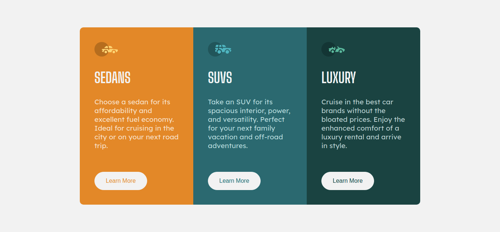
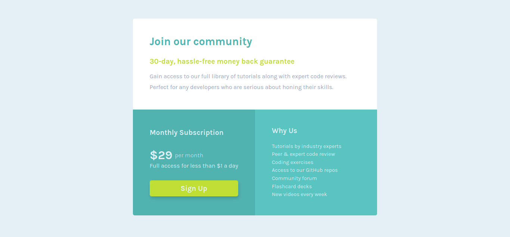
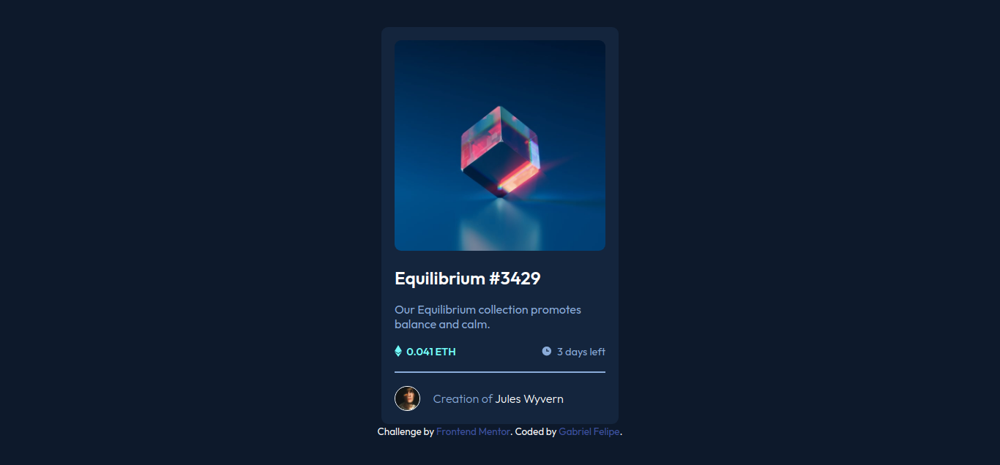

# Repositório de desafios

Repositório utilizado para arquivar todos os desafios oferecido pelo site [Frontend Mentor](https://www.frontendmentor.io/)

## Dificuldade 1(Newbie)

### 3 Column Preview Card Component Main

* [Link (Página)](https://gabrielfsoliveira.github.io/frontend-mentor/desafios/3-column-preview-card-component-main/)
* [Link (GitHub)](https://github.com/gabrielFSOliveira/frontend-mentor/tree/main/desafios/3-column-preview-card-component-main)

### Single Price Grid Component Master

* [Link (Página)](https://gabrielfsoliveira.github.io/frontend-mentor/desafios/single-price-grid-component-master/) 
* [Link (GitHub)](https://github.com/gabrielFSOliveira/frontend-mentor/tree/main/desafios/single-price-grid-component-master)

### Order summary component

* [Link (Página)](https://gabrielfsoliveira.github.io/frontend-mentor/desafios/order-summary-component-main/) 
* [Link (GitHub)](https://github.com/gabrielFSOliveira/frontend-mentor/tree/main/desafios/order-summary-component-main/)

### NFT Preview Card Component

* [Link (Página)](https://gabrielfsoliveira.github.io/frontend-mentor/desafios/nft-preview-card-component-main/) 
* [Link (GitHub)](https://github.com/gabrielFSOliveira/frontend-mentor/tree/main/desafios/nft-preview-card-component-main)

## Dificuldade 2(Junior)

### Testimonials grid section

* [Link (Página)](https://gabrielfsoliveira.github.io/frontend-mentor/desafios/testimonials-grid-section-main/)
* [Link (Github)](https://github.com/gabrielFSOliveira/frontend-mentor/tree/main/desafios/testimonials-grid-section-main)